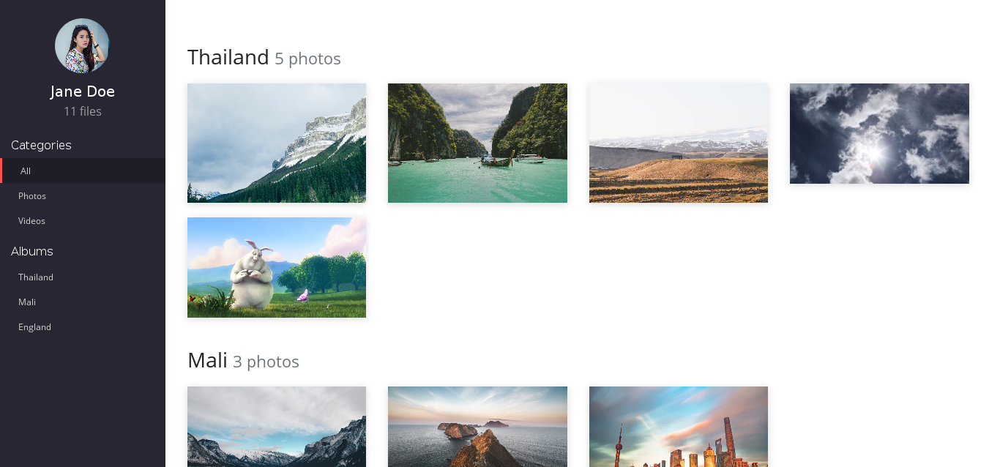

# Elemental Gallery

Elemental Gallery is a static data driven gallery with lightbox.This gallery is intended for individuals or groups who want to showcase their works or precious moments.

## Features
  - Album-wise listing
  - Photos (Gif,Jpg,and Png) & Videos (Direct URL or Youtube)
  - Sidebar with toggles for filtering videos and photos
  - Automatic thumbnails for youtube videos
  - Description support for photos. (with customizable alignment)

## Tech

Elemental Gallery uses a number of open source projects to work properly:

* [gLightbox](https://github.com/mcstudios/glightbox) - Awesome Vanilla JS Lightbox Library!
* [Bootstrap 4](https://getbootstrap.com) - awesome web-based text editor

## Installation

Soon

## Todos

 - Write MORE Tests
 - Add Night Mode

***

  
This work is licensed under a [Creative Commons Attribution-NonCommercial-ShareAlike 4.0 International License](http://creativecommons.org/licenses/by-nc-sa/4.0/).
